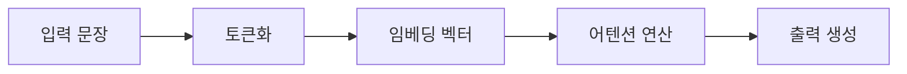

## 한 줄 요약

어텐션 메커니즘(Attention Mechanism)은 인공 신경망이 문장을 처리할 때 **지금 가장 중요한 단어에 선택적으로 가중치를 높이는** 구조다.

## 어떻게 연결되는가?

지식 베이스에서는 본문 안에서 다른 개념을 언급할 때 `[[getting-started|시작 가이드]]`처럼 위키링크를 넣으면 D3 온톨로지 그래프에 자동으로 연결선(Edge)이 생성됩니다.
